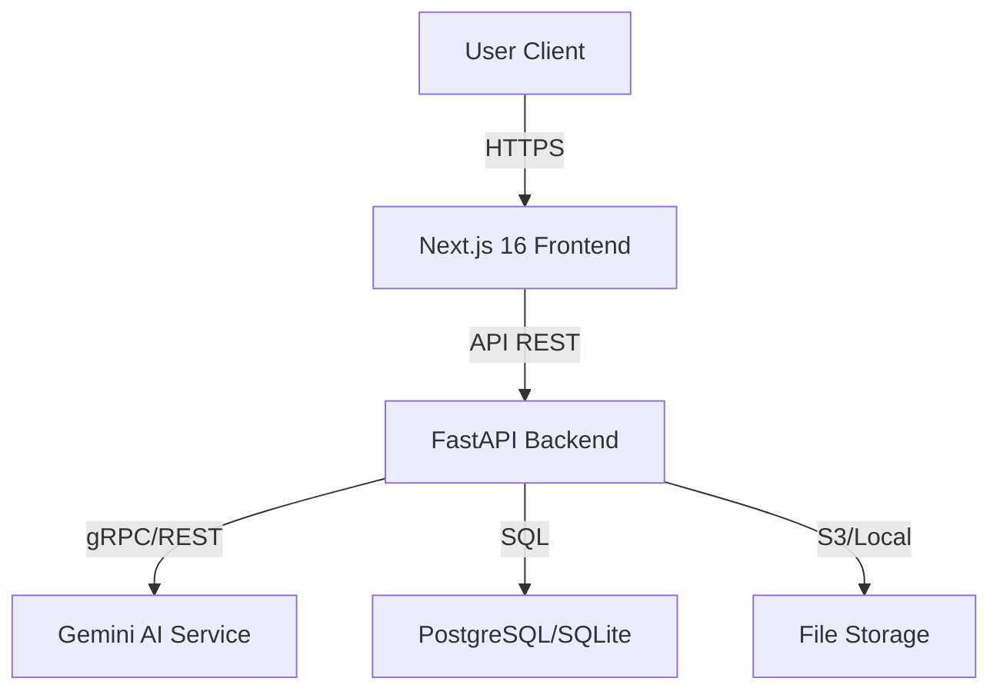

# MedSentry AI - Implementation Plan

## 1. Architecture Overview

### 1.1. High-Level Diagram


### 1.2. Tech Stack
- **Frontend**: Next.js 16 (App Router), Tailwind CSS, Shadcn/UI, Lucide Icons, TypeScript.
- **Backend**: Python 3.11+, FastAPI, Pydantic, SQLAlchemy.
- **AI**: Google Gemini Pro (Text), Gemini Pro Vision (Multimodal).
- **Database**: SQLite (Dev), PostgreSQL (Prod).
- **Storage**: Local filesystem (Dev), AWS S3 (Prod).

## 2. API Contracts

### 2.1. Endpoints
- `POST /api/v1/chat/analyze`: Send symptoms/text.
  - Input: `{ message: string, history: List[Message] }`
  - Output: `TriageResponse`
- `POST /api/v1/upload/analyze`: Upload file.
  - Input: `Multipart/Form-Data (file)`
  - Output: `AnalysisResponse`
- `GET /api/v1/history/{session_id}`: Get conversation history.

### 2.2. Data Models (Pydantic)
```python
class TriageLevel(str, Enum):
    LOW = "low"
    MEDIUM = "medium"
    HIGH = "high"

class TriageResponse(BaseModel):
    summary: str
    triage_level: TriageLevel
    suggested_next_steps: List[str]
    clarifying_questions: List[str]
    emergency_warning: Optional[str]
    disclaimer: str
```

## 3. Component Architecture (Frontend)

### 3.1. Pages
- `/`: Landing page + Chat Interface.
- `/dashboard`: User history and reports.
- `/clinician`: Review dashboard (protected).

### 3.2. Components
- `ChatInterface`: Handles message stream.
- `FileUpload`: Drag & drop zone.
- `TriageCard`: Visual display of risk level.
- `ReportViewer`: PDF/Image preview with overlay summary.

## 4. Security & Compliance Design
- **Encryption**: Use `Fernet` (symmetric) for sensitive fields in DB.
- **Anonymization**: Strip PII before sending to Gemini if possible, or ensure BAA.
- **Audit Logs**: Separate table `audit_logs` tracking all AI interactions.

## 5. Implementation Phases
1.  **Setup**: Repo structure, Next.js init, FastAPI init.
2.  **Backend Core**: API shell, Gemini integration, Pydantic models.
3.  **Frontend Core**: UI shell, Chat component, API client.
4.  **Features**: OCR pipeline, History tracking, Dashboard.
5.  **Hardening**: Security, Rate limiting, Error handling.
